## What I have learned
These past two weeks, I've learned about setting up operating systems on my windows computer! 
- I made an account on github, slack, and opencodingsociety
- I learned that github is a way to store and manage my code projects, and helps track every change I make
- I also joined the CSSE slack which is helpful for group communication
- Then, I made a copy of Mr. Mortensen's repository, Student, where I got a version to edit and add personalized information to. 
- I then worked on the about.md file within the navigation folder, where I added my own images and text
- Furthermore, I also learned how to access professional coding tools through a terminal, where we type in commands. I downloaded WSL, and Ubuntu, which are a part of Linux, and it is like a separate computer within my computer. 

```mermaid
flowchart TD
    %% GitHub Sources
    subgraph GitHub_Pages[GitHub: Open-Coding-Society/pages]
        A[Repo: pages]:::repo
    end

    subgraph GitHub_Template[GitHub: Open-Coding-Society/student]
        T[Template Repo: student]:::repo
    end

    subgraph GitHub_Student[GitHub: Rashig-1804/student]
        B[Repo: student]:::repo
    end

    %% Local Computer
    subgraph Local[Local Computer]
        subgraph opencs_dir[opencs/ directory]
            C[pages/]:::local
            Ccmd[VSCode Prep<br/><br/>./scripts/venv.sh<br/>source venv/bin/activate<br/>code .]:::cmd
        end
        subgraph user_dir[Rashig-1804/ directory]
            D[student/]:::local
            Dcmd[VSCode Prep<br/><br/>./scripts/venv.sh<br/>source venv/bin/activate<br/>code .]:::cmd
        end
    end

    %% Arrows: cloning
    A -.->|clone/pull only| C
    B <--> |clone, pull & push| D

    %% Arrows: template relationship
    T -.->|template→created| B

    %% Arrows: commands
    C --> Ccmd
    D <--> Dcmd

```

